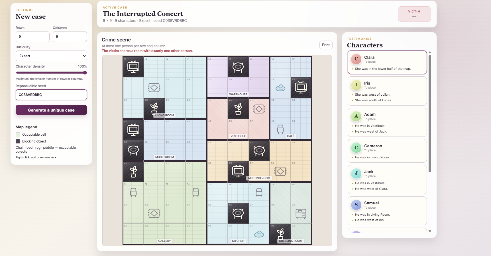

<div align="center">

# OpenAlibi

**Procedural mystery logic grids with deterministic seeds and verified unique solutions.**

[](https://github.com/JF10R/OpenAlibi/actions/workflows/pages.yml)

[Play OpenAlibi](https://jf10r.github.io/OpenAlibi/)

English · Français · Español

</div>

<p align="center">
  
</p>

OpenAlibi is a standalone web puzzle game where every case becomes a logic grid. Rooms, objects, characters, and testimonies are generated procedurally, then checked by an internal constraint solver before the case reaches the player.

The objective is to place every character, locate the victim, and identify the murderer through deduction.

## Highlights

| Feature | Description |
|---|---|
| **Verified cases** | The solver rejects cases with no solution or more than one solution. |
| **Deterministic generation** | The same seed and settings reproduce the same semantic case. |
| **Procedural maps** | Rooms, furniture, and obstacles follow plausible placement rules. |
| **Meaningful difficulty** | Direct, relational, and contextual clues vary across four levels. |
| **Trilingual interface** | The complete experience supports English, French, and Spanish, including generated names and testimonies. |
| **Zero runtime dependencies** | The application uses native HTML, CSS, and JavaScript only. |
| **Complete interface** | Dark mode, printing, hints, JSON export, and responsive layouts are included. |

## How to play

1. Choose the grid dimensions, character density, and difficulty.
2. Read the testimonies and place every character on an occupiable cell.
3. Never place two characters in the same row or column.
4. Place the victim last. The victim's name always begins with **V**.
5. Infer the murderer: they are the only other person in the victim's room.

“Next to” always means an orthogonally adjacent cell in the same room, never a diagonal cell.

## Case generation

- Square or rectangular grids from **4×4 to 12×12**
- Character density from **55% to 100%**
- At most `min(rows, columns)` characters
- Geometrically constrained room layouts
- Room-aware placement of occupiable and blocking objects
- Testimonies based on positions, rooms, objects, directions, and relationships
- No victim clue that reveals the victim's room or position
- Automatic murderer inference from the victim-room constraint

### Difficulty levels

| Level | Experience |
|---|---|
| **Easy** | More direct clues and redundant confirmations |
| **Medium** | A balance of positional, object, and relational clues |
| **Hard** | Few direct facts and more cross-referenced deductions |
| **Expert** | No coordinate shortcuts, repeated objects, and more ambiguous relations |

## Quick start

### Requirements

- A modern browser
- Python 3 to serve the files locally
- Node.js 18 or newer to run the tests

### Run the application

```bash
npm start
```

Then open [http://localhost:8080](http://localhost:8080).

If `python3` is not available on Windows:

```powershell
python -m http.server 8080
```

On macOS or Linux:

```bash
python3 -m http.server 8080
```

> Serve the application over HTTP. Opening `index.html` directly through a `file://` URL prevents JavaScript modules from loading in several browsers.

## Localization

OpenAlibi ships with English (`en`), French (`fr`), and Spanish (`es`). The selected language is stored in the browser and can be changed without regenerating the current case or losing progress.

The localization layer in `src/i18n.js` provides:

- message catalogs with interpolation;
- stable room and object identifiers separated from translated labels;
- locale-specific character and victim name catalogs;
- translated case titles, clues, hints, statuses, dialogs, and accessibility labels;
- fallback to English for unsupported locale codes.

To add a language, extend its catalogs with the same translation keys and register its locale code in `SUPPORTED_LOCALES`. The localization tests verify catalog parity and semantic case stability across languages.

## Seeds and reproducibility

Automatically generated seeds contain 10 unambiguous characters. A case identity uses a 128-bit digest derived from:

- the generator version;
- the visible seed;
- dimensions;
- density;
- difficulty;
- the regeneration attempt.

The locale is intentionally excluded from the generation key. Changing languages preserves the map, objects, solution, and case ID while translating names and content.

To reproduce a case, use the same seed and settings.

## Tests

```bash
npm test
```

The test suites cover:

- solution uniqueness;
- row and column constraints;
- occupiable-cell validity;
- room and object geometry;
- victim-clue privacy;
- automatic murderer inference;
- seed reproducibility and identity isolation;
- translation catalog completeness;
- locale-specific names and pronouns;
- semantic stability across languages;
- core interface contracts.

## Architecture

```text
openalibi/
├── index.html                 Application structure and translatable markup
├── styles.css                Layout, themes, responsiveness, and print styles
├── src/
│   ├── app.js                State, rendering, interactions, and locale switching
│   ├── core.js               Generator, constraints, solver, and validation
│   └── i18n.js               Message, room, object, title, and name catalogs
├── tests/
│   ├── generator.test.mjs    Generator and solver tests
│   ├── i18n.test.mjs         Localization and cross-locale stability tests
│   └── ui.test.mjs           Static interface contracts
└── package.json              Project commands
```

The domain core is independent of the DOM and runs in both modern browsers and Node.js.

## Technology

- Semantic HTML5
- Modern CSS
- JavaScript ES modules
- Web Crypto
- Dependency-free Node.js tests

## Contributing

Contributions are welcome.

1. Create a focused branch.
2. Make one coherent change.
3. Add or update relevant tests.
4. Run `npm test`.
5. Open a pull request that concisely explains the problem and solution.

Keep source code, tests, documentation, commits, issues, and pull requests in English.

## Project status

OpenAlibi is under active development. The current generator format is **version 5**.

## License

OpenAlibi is available under the [MIT License](./LICENSE). You may use, modify, and redistribute the project provided that the copyright notice and license text are retained.
